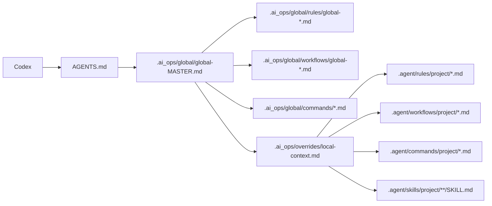
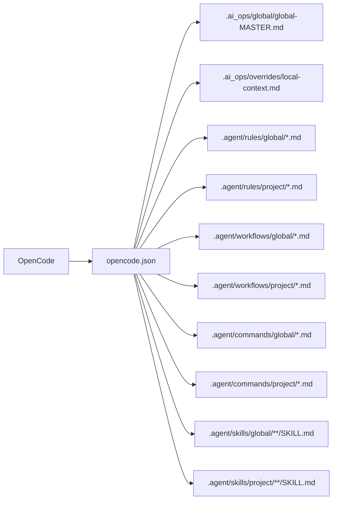
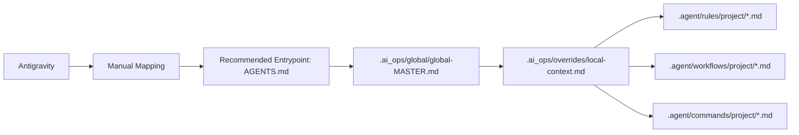
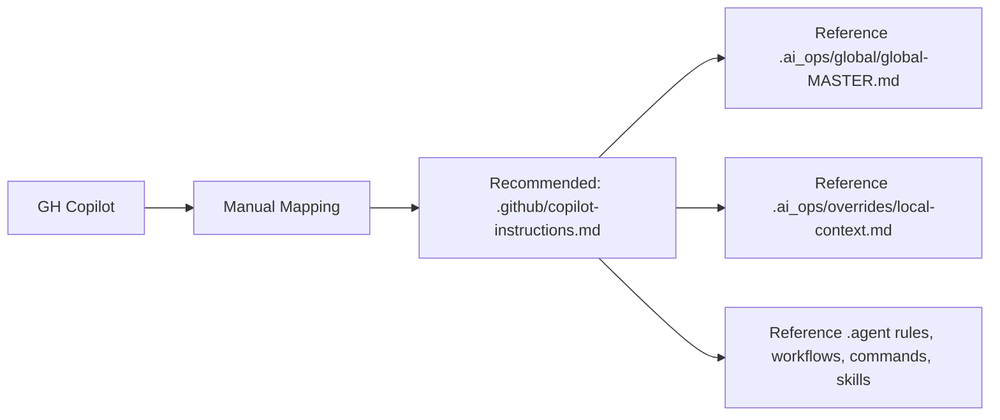

# central_ai_ops

Central AI operations framework with a layered model:
- One global baseline in this repo (`global/global-MASTER.md`)
- One flattened project-local context in each project repo (`.ai_ops/overrides/local-context.md`)
- SRW runtime policy + command playbooks in project and global `.agent/*` folders
- Optional canonical project source to sync overrides across IDE clones

## Directory Structure
- `global/global-MASTER.md` - Canonical global baseline for AGENTS/CLAUDE/Cursor/Gemini entrypoints
- `global/global-AGENTS.md` - Legacy compatibility wrapper to MASTER
- `global/global-CLAUDE.md` - Legacy compatibility wrapper to MASTER
- `global/global-opencode.md` - OpenCode load-order baseline
- `global/rules/global-*.md` - Global rule set (includes mandatory security rule)
- `global/workflows/global-*.md` - Global workflow set
- `global/workflows/global-application-blueprint.md` - Global template for project `docs/APPLICATION_BLUEPRINT.md`
- `global/commands/*.md` - Global command playbooks (shared operational commands)
- `global/cursor/global-cursor-*.md|*.mdc` - Global Cursor baseline
- `scripts/bootstrap_link.sh` - Bootstraps any project repo
- `scripts/link_ai_governance.sh` - Applies layered links + scaffolding
- `scripts/ensure_governance_links.sh` - Hook-safe sync for client repos
- `scripts/verify_governance_integrity.sh` - Fails when governance files/docs/load-order drift

## Governance Diagram
```mermaid
flowchart TD
  C[central_ai_ops/global/*] --> G1[project/.ai_ops/global]
  C --> G2[project/.agent/rules/global]
  C --> G3[project/.agent/workflows/global]
  C --> G4[project/.agent/commands/global]
  C --> G5[project/.agent/skills/global]
  C --> G6[project/.cursor/rules/global-cursor-rule.mdc]

  G1 --> M1[AGENTS.md -> global-MASTER.md]
  G1 --> M2[CLAUDE.md -> global-MASTER.md]
  G1 --> M3[.cursorrules -> global-MASTER.md]
  G1 --> M4[GEMINI.md -> global-MASTER.md]

  O1[.ai_ops/overrides/local-context.md] --> M1
  O1 --> M2
  O1 --> M3
  O1 --> M4

  G2 --> R1[.agent/rules/global + project]
  G3 --> R2[.agent/workflows/global + project]
  G4 --> R3[.agent/commands (global + project)]
  G5 --> R4[.agent/skills/global + project]
```

## Agent Rule Loading Matrix
| Agent | Support Mode | Entrypoint | Baseline | Project Business Logic | Runtime Policy |
| --- | --- | --- | --- | --- | --- |
| Codex | Auto-scaffolded | `AGENTS.md` | `.ai_ops/global/global-MASTER.md` | `.ai_ops/overrides/local-context.md` | `.agent/rules/*`, `.agent/workflows/*`, `.agent/commands/*`, `.agent/skills/*` |
| Cursor | Auto-scaffolded | `.cursorrules` | `.ai_ops/global/global-MASTER.md` + cursor mdc | `.ai_ops/overrides/local-context.md` | cursor mdc + `.agent/*` |
| OpenCode | Auto-scaffolded | `opencode.json` | `.ai_ops/global/global-MASTER.md` | `.ai_ops/overrides/local-context.md` | `.agent/rules/*`, `.agent/workflows/*`, `.agent/commands/*`, `.agent/skills/*` |
| Claude | Auto-scaffolded | `CLAUDE.md` | `.ai_ops/global/global-MASTER.md` | `.ai_ops/overrides/local-context.md` | `.agent/rules/*`, `.agent/workflows/*`, `.agent/commands/*`, `.agent/skills/*` |
| Gemini | Auto-scaffolded | `GEMINI.md` | `.ai_ops/global/global-MASTER.md` | `.ai_ops/overrides/local-context.md` | `.agent/rules/*`, `.agent/workflows/*`, `.agent/commands/*`, `.agent/skills/*` |
| Antigravity | Manual mapping | Recommended: `AGENTS.md` | Recommended: `.ai_ops/global/global-MASTER.md` | Recommended: `.ai_ops/overrides/local-context.md` | Recommended: `.agent/*` (including commands) |
| GH Copilot | Manual mapping | Recommended: `.github/copilot-instructions.md` | Reference `global-MASTER.md` | Reference `local-context.md` | Reference `.agent/*` (including commands) |

All global paths above are symlinked from this repo into each bootstrapped project.

## Agent-Specific Diagrams

### Codex


### Cursor
```mermaid
flowchart LR
  A[Cursor] --> B[.cursorrules]
  B --> C[.ai_ops/global/global-MASTER.md]
  A --> D[.cursor/rules/global-cursor-rule.mdc]
  D --> E[.ai_ops/global/rules/global-*.md]
  D --> F[.ai_ops/global/workflows/global-*.md]
  D --> G[.ai_ops/overrides/local-context.md]
  D --> H[.cursor/rules/{project}-cursor-overrides.mdc]
```

### OpenCode


### Claude


### Gemini


### Antigravity


### GH Copilot


## Precedence
1. Global baseline from `.ai_ops/global/global-MASTER.md`
2. Project business context from `.ai_ops/overrides/local-context.md`
3. Project runtime policy from `.agent/*/project/*`

Project-local content overrides global content on conflict.

## Security Gate
`global/rules/global-security.md` defines a mandatory pre-flight security rule, including:
- secret exposure checks
- Prisma ORM compliance checks
- CodeQL/CI readiness requirements

## Bootstrap a Project
```bash
cd ~/dev/central_ai_ops
scripts/bootstrap_link.sh /path/to/project/repo
```

## Bootstrap With Canonical Project Source
```bash
cd ~/dev/central_ai_ops
scripts/bootstrap_link.sh --project-source /path/to/canonical/project/repo /path/to/ide/clone/repo
```

When `--project-source` is set, these project-local paths are linked from the canonical repo:
- `.ai_ops/overrides`
- `.agent/rules/project`
- `.agent/workflows/project`
- `.agent/commands/project`
- `.agent/skills/project`
- `.cursor/rules/<project>-cursor-overrides.mdc`

## Ongoing Sync
Client repos auto-sync via git hooks. Manual sync is also available:
```bash
cd /path/to/project/repo
bash scripts/ensure_governance_links.sh
```

## Governance Change Rule
When adding/updating governance artifacts under `global/`:
1. Update `global/global-MASTER.md` load paths/references if needed.
2. Update governance docs (`README.md`, `ONBOARDING.md`) when structure or expectations change.
3. Run integrity verification before sharing:

```bash
cd ~/dev/central_ai_ops
bash scripts/verify_governance_integrity.sh
```

Optional shell alias:
```bash
alias ai-sync='bash scripts/ensure_governance_links.sh'
```
